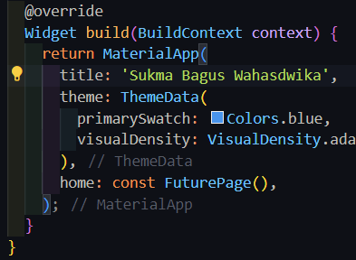
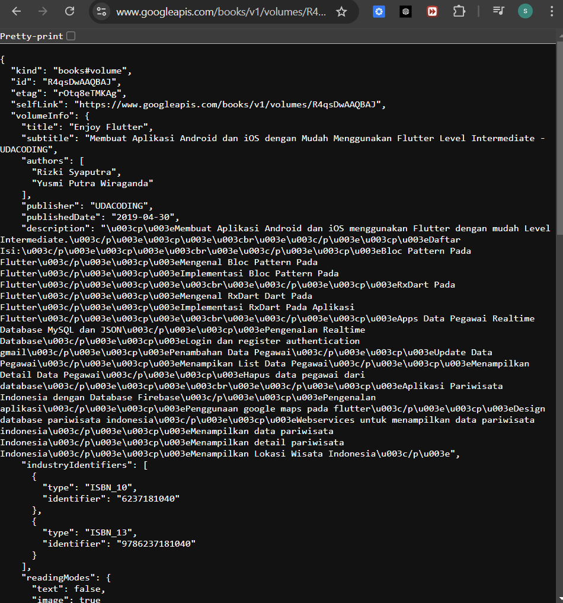
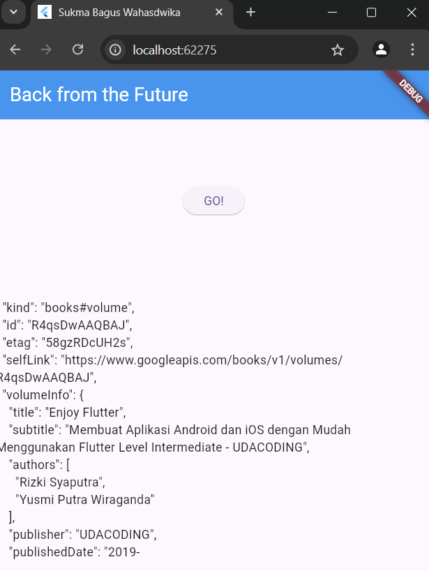

## **Nama : Sukma Bagus Wahasdwika**

## **NIM  : 2241720223**

# **Pemrograman Asynchronous**

## **Praktikum 1: Mengunduh Data dari Web Service (API)**

### **Soal 1 : Tambahkan nama panggilan Anda pada title app sebagai identitas hasil pekerjaan Anda.**

### **Soal 2 Carilah judul buku favorit Anda di Google Books, lalu ganti ID buku pada variabel path di kode tersebut. Caranya ambil di URL browser Anda seperti gambar berikut ini.**

### **Soal 3:**
* Jelaskan maksud kode langkah 5 tersebut terkait substring dan catchError!

    Kode tersebut memanfaatkan substring untuk membatasi tampilan data API dan menggunakan catchError untuk menangani kesalahan yang mungkin terjadi selama proses pengambilan data. Hal ini memastikan aplikasi tetap responsif dan memberikan umpan balik yang jelas kepada pengguna jika terjadi masalah.

* Capture hasil praktikum Anda berupa GIF dan lampirkan di README. Lalu lakukan commit dengan pesan "W11: Soal 3".

