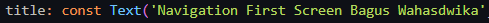

## **Nama : Sukma Bagus Wahasdwika**

## **NIM  : 2241720223**

# **Pemrograman Asynchronous**

## **Praktikum 1 - Mengunduh Data dari Web Service (API)**

### **Soal 1: Tambahkan nama panggilan Anda pada title app sebagai identitas hasil pekerjaan Anda.**

### **Soal 2: Carilah judul buku favorit Anda di Google Books, lalu ganti ID buku pada variabel path di kode tersebut. Caranya ambil di URL browser Anda seperti gambar berikut ini.**

### **Soal 3:**
* Jelaskan maksud kode langkah 5 tersebut terkait substring dan catchError!

    Kode tersebut memanfaatkan substring untuk membatasi tampilan data API dan menggunakan catchError untuk menangani kesalahan yang mung
* Capture hasil praktikum Anda berupa GIF dan lampirkan di README. Lalu lakukan commit dengan pesan "W11: Soal 3".

    

## **Praktikum 2 - Menggunakan await/async untuk menghindari callbacks**

### **Soal 4:**
* Jelaskan maksud kode langkah 1 dan 2 tersebut!

    Langkah 1: Membuat fungsi-fungsi yang mensimulasikan proses yang membutuhkan waktu, masing-masing mengembalikan nilai tertentu (1, 2, dan 3).
    Langkah 2: Membuat fungsi count() untuk menghitung total nilai dari ketiga fungsi asynchronous tersebut secara berurutan (total = 1 + 2 + 3 = 6).
    Hasil Akhir: Setelah proses selesai, UI akan diperbarui untuk menampilkan hasil total (6) setelah 9 detik (3 detik x 3 fungsi).

* Capture hasil praktikum Anda berupa GIF dan lampirkan di README. Lalu lakukan commit dengan pesan "W11: Soal 4".

    

## **Praktikum  3 - Menggunakan Completer di Future**

### **Soal 5:**
* Jelaskan maksud kode langkah 2 tersebut!

    Panggilan getNumber() akan mengembalikan sebuah Future yang akan selesai dengan nilai 42 setelah 5 detik.
    Kode tersebut menggambarkan bagaimana menggunakan completer untuk mengontrol penyelesaian sebuah Future secara manual, terutama dalam situasi dimana kita memiliki logika kompleks atau perlu menyelesaikan Future di waktu yang tidak langsung.

* Capture hasil praktikum Anda berupa GIF dan lampirkan di README. Lalu lakukan commit dengan pesan "W11: Soal 5".

    

### **Soal 6:**
* Jelaskan maksud perbedaan kode langkah 2 dengan langkah 5-6 tersebut!

    Langkah 2 menunjukkan versi dasar dari penggunaan Completer untuk menyelesaikan sebuah proses sederhana. Sementara itu, Langkah 5-6 menambahkan fleksibilitas dan keandalan dengan menangani error, memisahkan logika penghitungan, dan memberikan kontrol lebih besar terhadap bagaimana hasil ditampilkan di UI.

* Capture hasil praktikum Anda berupa GIF dan lampirkan di README. Lalu lakukan commit dengan pesan "W11: Soal 6".

    

## **Praktikum  4 - Memanggil Future secara paralel**

### **Soal 7:**
* Capture hasil praktikum Anda berupa GIF dan lampirkan di README. Lalu lakukan commit dengan pesan "W11: Soal 7".

    

### **Soal 8:**
* Jelaskan maksud perbedaan kode langkah 1 dan 4!
    Langkah 1:
    - Bisa menambahkan future secara dinamis sebelum grup ditutup.	
    - Memerlukan lebih banyak kode dan pengelolaan eksplisit.
    - 	Cocok untuk situasi dengan kumpulan future yang tidak pasti sejak awal.
    - Harus memanggil close() secara manual sebelum hasil diproses.	

    Langkah 4:
    - Semua future harus diketahui dan didefinisikan sekaligus.
    - Lebih ringkas dan mudah diimplementasikan.
    - Cocok jika semua future sudah pasti sejak awal.
	- Tidak memerlukan langkah tambahan seperti close().

## **Praktikum  5 - Menangani Respon Error pada Async Code**

### **Soal 9:**
* Capture hasil praktikum Anda berupa GIF dan lampirkan di README. Lalu lakukan commit dengan pesan "W11: Soal 9".

    

    **Debug Console**
    

### **Soal 10**
* Panggil method handleError() tersebut di ElevatedButton, lalu run. Apa hasilnya? Jelaskan perbedaan kode langkah 1 dan 4!

    

    - Saat returnError() dipanggil langsung:
        Setelah 2 detik, exception akan dilempar dengan pesan 'Something terrible happened!'. Jika tidak ada penanganan error, aplikasi bisa crash.
    - Saat handleError() dipanggil:
        - Setelah 2 detik, returnError() akan melempar exception.
        - Exception tersebut ditangkap di dalam blok catch, lalu nilai variabel result diperbarui menjadi 'Exception: Something terrible happened!'.
        - Teks 'Complete' dicetak di konsol sebagai tanda eksekusi selesai.
        - Tidak ada crash karena error ditangani dengan baik.

    Langkah 1: returnError()
    Kode ini merupakan sebuah method Future yang mensimulasikan terjadinya error dengan sengaja menggunakan throw Exception().

    - Fungsi ini menggunakan Future.delayed untuk menunda eksekusi selama 2 detik.
    - Setelah penundaan, fungsi ini menghasilkan sebuah exception dengan pesan 'Something terrible happened!'.
    - Tidak ada mekanisme penanganan error dalam fungsi ini; exception hanya dilempar dan perlu ditangani di tempat lain.

    Langkah 4: handleError()
    Kode ini merupakan sebuah method Future yang memanggil fungsi returnError() dan menangani error yang terjadi menggunakan blok try-catch-finally.

    - Blok try:
        Menjalankan returnError() yang berpotensi melempar error.
    - Blok catch:
        Menangkap error yang dilempar oleh returnError() dan mengubah state aplikasi dengan memperbarui nilai variabel result menjadi string dari error tersebut.
    - Blok finally:
        Menjalankan kode yang selalu dieksekusi, terlepas dari apakah error terjadi atau tidak. Dalam kasus ini, hanya mencetak 'Complete' ke konsol.

## **Praktikum  6 - Menggunakan Future dengan StatefulWidget**

### **Soal 11:**
* Tambahkan nama panggilan Anda pada tiap properti title sebagai identitas pekerjaan Anda.

    

### **Soal 12:**
* Jika Anda tidak melihat animasi loading tampil, kemungkinan itu berjalan sangat cepat. Tambahkan delay pada method getPosition() dengan kode await Future.delayed(const Duration(seconds: 3));
* Apakah Anda mendapatkan koordinat GPS ketika run di browser? Mengapa demikian?

    

    Saat melakukan run di browser, browser meminta izin lokasi untuk mendapatkan koordinat GPS. Karena  privasi dan keamanan. Browser meminta izin agar pengguna tahu bahwa aplikasi web ingin mengakses data lokasi mereka, untuk melindungi informasi pribadi pengguna.

* Capture hasil praktikum Anda berupa GIF dan lampirkan di README. Lalu lakukan commit dengan pesan "W11: Soal 12".

    

## **Praktikum  7 - Manajemen Future dengan FutureBuilder**

### **Soal 13:**
* Apakah ada perbedaan UI dengan praktikum sebelumnya? Mengapa demikian?
    - Kode Sebelumnya: UI diperbarui secara manual menggunakan setState() setelah mendapatkan posisi melalui metode initState() dan getPosition(). Indikator pemuatan hanya muncul jika data lokasi belum selesai diambil.

    - Kode Sekarang: Menggunakan FutureBuilder untuk menangani data asinkron, yang secara otomatis mengelola pembaruan UI berdasarkan status koneksi (seperti waiting, done, dll.).

    - Kontrol Tampilan:
        - Kode Sebelumnya: UI bergantung pada variabel lokal myPosition untuk menentukan apakah animasi pemuatan atau teks lokasi yang ditampilkan.
        - Kode Sekarang: UI menjadi lebih dinamis karena FutureBuilder secara otomatis menyesuaikan tampilan berdasarkan status snapshot (misalnya: waiting, done, atau error).

    - Responsivitas Error:
        - Kode Sebelumnya: Tidak ada penanganan error yang baik, seperti saat pengguna menolak izin lokasi.
        
        - Kode Sekarang: Error diperiksa dalam FutureBuilder dan tampilan error akan ditampilkan jika terjadi masalah (misalnya "Something terrible happened!").
* Capture hasil praktikum Anda berupa GIF dan lampirkan di README. Lalu lakukan commit dengan pesan "W11: Soal 13".
    
    

* Seperti yang Anda lihat, menggunakan FutureBuilder lebih efisien, clean, dan reactive dengan Future bersama UI.

### **Soal 14:**
* Apakah ada perbedaan UI dengan langkah sebelumnya? Mengapa demikian?

    * Jika error terjadi, UI mungkin tetap mencoba menampilkan data kosong atau null, sehingga hasilnya seperti bug.

    * UI lebih informatif karena menampilkan pesan error seperti pada praktikum 5 "Something terrible happened!" ketika ada masalah, sehingga pengguna menyadari    bahwa ada kendala.

* Capture hasil praktikum Anda berupa GIF dan lampirkan di README. Lalu lakukan commit dengan pesan "W11: Soal 14".

    

## **Praktikum  8 - Navigation route dengan Future Function**

### **Soal 15:**
* Tambahkan nama panggilan Anda pada tiap properti title sebagai identitas pekerjaan Anda.

    

* Silakan ganti dengan warna tema favorit Anda.

    

### **Soal 16:**
* Cobalah klik setiap button, apa yang terjadi ? Mengapa demikian ?
    Klik Tombol "Red", "Green", atau "Blue": 
    Warna latar belakang layar pertama berubah sesuai tombol yang diklik.
    Kembali Tanpa Memilih Tombol: 
    Warna latar belakang layar pertama tetap sebagai default. Ini terjadi karena data dikirim kembali dari layar kedua ke layar pertama menggunakan Navigator.pop(context, data), dan layar pertama diperbarui dengan warna yang diterima.

* Gantilah 3 warna pada langkah 5 dengan warna favorit Anda!

    

* Capture hasil praktikum Anda berupa GIF dan lampirkan di README. Lalu lakukan commit dengan pesan "W11: Soal 16".

    

